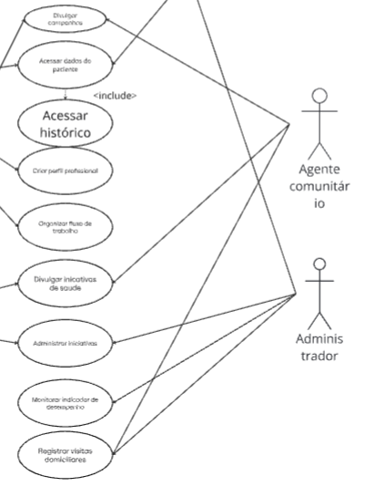
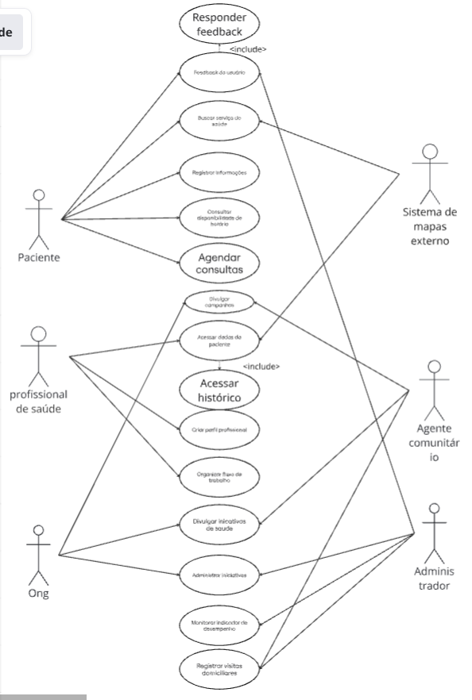

# Diagrama de Casos de Uso

Tem por objetivo apresentar uma visão externa das funções e serviços que o sistema deverá oferecer aos usuários, sem se preocupar em como tais funções serão implementadas

Para este estudo, usamos como base o projeto Connect Care, um app para ajudar pessoas numa comunidade necessitada.

### Atores

Os atores são papéis que um usuário desempenha com relação ao sistema. Podem ser humanos, sistemas ou dispositivos de hardware.

- Quem ou o quê utiliza o sistema? 
- Quem ou o quê recebe informações do sistema?
- Quem ou o quê provê informações para o sistema? 
- Em que lugar da empresa o sistema será utilizado?
- Quem ou o quê suporta e mantém o sistema?
- Que outros sistemas utilizam este sistema?

**Os atores identificados na Connect Care são:**

- **Pacientes**: utilizam diretamente do sistema para buscar informações, além de realizar um registro manual.
  
-** Sistema de informações**: usa das informações do paciente para acessar, pelo sistema, pontos de interesse.
 
- **Profissional de saúde**: acessa a plataforma para acessar exames e detalhes do Paciente.
  
- **Agentes comunitários:** usam o sistema para identificar áreas prioritárias.
  
- **ONG:** usam o sistema para divulgar e gerenciar iniciativas.
    
- **Administrador**: garante a segurança da plataforma, usando o sistema para obter informações sobre o app no geral.

### Casos de Uso

Usando o formato “**Verbo no infinitivo + Objeto**”, identificamos os seguintes casos de uso:

### Paciente

- Registrar com informações pessoais;
- Buscar serviços de saúde;
- Realizar agendamento de consultas;
- Consultar disponibilidade de horários;
- Realizar feedback da consulta;

### Sistema de informações

- Coletar dados do paciente;
- Buscar postos de saúde próximos do paciente;
- Indicar campanhas existentes;

### Profissional de saúde

- Gerenciar atendimentos de pacientes;
- Acessar informações de pacientes;
- Criar perfil profissional;
- Organizar fluxo de trabalho;
- Visualizar agenda de consultas;
- Acessar histórico do paciente;
- Atualizar prontuário do paciente;

### Ongs

- Divulgar campanhas;
- Divulgar iniciativas de saúde;
- Administrar iniciativas;

### Agentes comunitários

- Registrar visitas domiciliares;
- Criar relatórios de condições de saúde;
- Identificar áreas prioritárias.

### Administrador

- Integrar novas funcionalidades;
- Atualizar informações de parceiros;
- Responder feedback do usuário;
- Monitorar indicadores de desempenho;

### Diagrama no miro

<iframe width="768" height="432" src="https://miro.com/app/live-embed/uXjVJHChsK4=/?embedMode=view_only_without_ui&moveToViewport=-107585,-9026,29568,19204&embedId=411380534809" frameborder="0" scrolling="no" allow="fullscreen; clipboard-read; clipboard-write" allowfullscreen></iframe>

:::::

---

# Especificações de caso de uso

Abaixo está a especificação completa de cinco casos de uso selecionados para detalhamento.

## 1. Realizar Agendamento de Consultas

#### 1.1 Breve Descrição

Para o seguinte experimento, utilizamos de um exemplo geral: um adulto levando seu filho à um médico.

Permite ao Paciente, através do aplicativo, localizar postos de saúde próximos, verificar a disponibilidade de médicos por especialidade (pediatria) e efetuar o agendamento de uma consulta para seu filho. O sistema deve confirmar o agendamento ou informar sobre a indisponibilidade.

#### 1.2 Atores

* **Ator Principal:** Paciente
* **Atores Secundários:** Sistema de Localização (GPS) e Profissional de saúde (recebe a confirmação).

---

### 2. Fluxo de Eventos

#### 2.1 Fluxo Principal

O caminho padrão para um agendamento bem-sucedido.

| Passo | Ação do Ator (Paciente) | Ação do Sistema |
| :--- | :--- | :--- |
| 1 | O Paciente acessa a função de "Agendamento de Consultas" no aplicativo. | |
| 2 | O Paciente informa a especialidade desejada (pediatria) e a localização atual ou CEP. | O Sistema [RN01] exibe um mapa com os postos de saúde próximos (até 5km) e o tempo de deslocamento estimado. |
| 3 | O Paciente seleciona o posto de saúde de sua preferência. | |
| 4 | O Paciente seleciona o médico desejado e o dia do agendamento. | O Sistema consulta a agenda do médico selecionado e [RN02] exibe os horários disponíveis. |
| 5 | O Paciente seleciona o horário desejado. | |
| 6 | O Sistema solicita a confirmação dos dados (posto, médico, data, hora, nome do paciente/filho). | |
| 7 | O Paciente confirma o agendamento. | O Sistema [RN03] reserva o horário na agenda do médico, [Pós-condição 1] registra o agendamento no sistema e [Pós-condição 2] envia uma notificação de confirmação. |
| 8 | | O Sistema exibe a tela de confirmação do agendamento com o número de protocolo. |

#### 2.2 Fluxos Alternativos

Variações do fluxo principal que não são erros.

* **[FA01] Troca de Localização (iniciado no passo 2.1.2)**
    * 2.2.1.1 O Paciente insere manualmente um novo endereço ou CEP diferente do atual.
    * 2.2.1.2 O Sistema recalcula e [RN01] exibe os postos de saúde próximos à nova localização.
    * 2.2.1.3 O fluxo retorna ao passo 2.1.3.

* **[FA02] Indisponibilidade na Agenda (iniciado no passo 2.1.4)**
    * 2.2.2.1 O Paciente seleciona um dia sem horários disponíveis.
    * 2.2.2.2 O Sistema exibe a mensagem "Não há horários livres neste dia" e sugere datas próximas com disponibilidade.
    * 2.2.2.3 O fluxo retorna ao passo 2.1.4 (seleção de dia).

#### 2.3 Fluxos de Exceção

Erros e falhas.

* **[FE01] Postos de Saúde Indisponíveis (iniciado no passo 2)**
    * 2.3.1.1 Se o Sistema [RN01] não encontrar postos de saúde em um raio de 5km (ou na especialidade desejada) OU se todos os postos próximos estiverem com a agenda lotada.
    * 2.3.1.2 O Sistema exibe a mensagem de erro: **"Não foi possível encontrar postos de saúde próximos com horários livres para a especialidade de Pediatria."**
    * 2.3.1.3 O Sistema encerra o caso de uso.

* **[FE02] Campo Obrigatório Incompleto (iniciado em qualquer passo)**
    * 2.3.2.1 O Paciente tenta avançar sem preencher um campo obrigatório (Ex: Especialidade, Médico, Horário).
    * 2.3.2.2 O Sistema exibe a mensagem de erro: **"Informação incompleta. Por favor, preencha o campo [Nome do Campo] para continuar."**
    * 2.3.2.3 O fluxo permanece no passo atual.

* **[FE03] Horário Selecionado Ocupado (iniciado no passo 7)**
    * 2.3.3.1 Durante o processamento da reserva, outro Paciente simultaneamente reservou o mesmo horário.
    * 2.3.3.2 O Sistema cancela a reserva atual e exibe a mensagem: **"O horário selecionado não está mais disponível. Por favor, escolha outro horário."**
    * 2.3.3.3 O fluxo retorna ao passo 2.1.4 (seleção de dia).

---

### 3. Requisitos Especiais

* O agendamento deve ser otimizado para dispositivos móveis (Android e iOS) diferentes.
* O sistema deve consultar a localização do usuário com permissão explícita (GPS).
* O tempo de resposta para a consulta de disponibilidade (passo 2.1.4) não deve exceder 2 segundos.

### 4. Regras de Negócio

* **[RN01]** A busca por postos de saúde deve priorizar a distância física (raio de 5km) e a especialidade desejada (pediatria, por exemplo).
* **[RN02]** A disponibilidade de horários é determinada pela agenda médica real e deve ser exibida em tempo real.
* **[RN03]** Após a confirmação (passo 7), o horário é imediatamente bloqueado na agenda do médico.
* **[RN04]** O Paciente só pode agendar consultas para ele próprio ou dependentes cadastrados em seu perfil, não podendo realizar consultas para outrem sem cadastro de informações prévio.

### 5. Precondições

* O Paciente deve estar autenticado no aplicativo.
* O serviço de localização (GPS) do Paciente deve estar ativo (se a busca for por proximidade).
* O Paciente deve ter dependentes (filho, padrasto, mãe, etc) cadastrados no sistema (Referência RN04).

### 6. Pós-condições

* **[Pós-condição 1]** O agendamento é registrado no sistema de trabalho do profissional de saúde.
* **[Pós-condição 2]** Uma notificação de confirmação é enviada ao Paciente e ao Profissional de Saúde.
* **[Pós-condição 3]** O horário reservado é marcado como indisponível na agenda do médico.

### 7. Pontos de Extensão

* No passo 7, este caso de uso pode ser estendido por **"Gerar Lembrete de Consulta"**.
* No passo 2, este caso de uso pode ser estendido por **"Consultar Histórico de Agendamentos"**.

-----

## 2. Criar perfil profissional

#### 1.1 Breve Descrição
O caso de uso "Criar Perfil Profissional" tem como objetivo permitir que o usuário registre suas informações pessoais, experiências e habilidades em um perfil organizado dentro da plataforma.

O ator deseja criar e registrar seu perfil profissional, enquanto o sistema oferece os meios para coletar, salvar e disponibilizar essas informações de forma estruturada.

#### 1.2 Atores
- **Ator Principal:** Profissional da Saúde - responsável por iniciar a ação de criar o perfil profissional
- **Atores Secundários:**  
  - Sistema de autentificção - responsável por validar a identidade do profissional antes da criação do perfil.
  
#### 2. Fluxo de Eventos

##### 2.1 Fluxo Principal

| Passo    | Ação                                                                 |
|----------|----------------------------------------------------------------------|
| **2.1.1** | O **Profissional da Saúde** acessa a opção *Criar Perfil Profissional*. |
| **2.1.2** | O **Sistema** exibe o formulário de criação de perfil.               |
| **2.1.3** | O **Profissional da Saúde** preenche suas informações profissionais.                  |
| **2.1.4** | O **Sistema** valida os dados informados.                       |
| **2.1.5** | O **Sistema** registra o novo perfil no banco de dados.              |
| **2.1.6** | O **Sistema** confirma a criação do perfil exibindo uma mensagem de sucesso. |

### 2.2 Fluxos Alternativos

#### [FA01] – Edição opcional de informações adicionais
**Origem:** Passo 2.1.3  
1. O **Ator** opta por adicionar informações complementares ao perfil (ex.: certificações, idiomas).  
2. O **Sistema** exibe os campos opcionais correspondentes.  
3. O **Ator** preenche os campos desejados.  
**Retorno:** O fluxo volta ao passo 2.1.4.

---

#### [FA02] – Indicação de experiência profissional prévia
**Origem:** Passo 2.1.3  
1. O **Ator** decide incluir experiências profissionais anteriores.  
2. O **Sistema** exibe os campos para cargo, instituição, período e descrição da atividade.  
3. O **Ator** adiciona uma ou mais experiências.  
**Retorno:** O fluxo volta ao passo 2.1.4.

---

#### [FA03] – Inserção de links externos
**Origem:** Passo 2.1.3  
1. O **Ator** opta por inserir links relevantes (ex.: LinkedIn, portfólio, site profissional).  
2. O **Sistema** apresenta os campos para adicionar URLs .  
3. O **Ator** insere um ou mais links.  
4. O **Sistema** verifica se os links possuem formato válido.  
**Retorno:** O fluxo volta ao passo 2.1.4.

### 2.3 Fluxos de Exceção

#### [FE01] – Dados obrigatórios ausentes
**Origem:** Passo 2.1.4  
1. O **Sistema** identifica que campos obrigatórios não foram preenchidos.  
2. O **Sistema** exibe mensagem informando os campos faltantes e solicita correção.  
**Retorno:** O fluxo retorna ao passo 2.1.3.

---

#### [FE02] – Formato de dados inválido
**Origem:** Passo 2.1.4  
1. O **Sistema** detecta dados em formato inválido (ex.: e-mail incorreto, telefone incompleto).  
2. O **Sistema** destaca os campos inválidos e orienta o ator a corrigir.  
**Retorno:** O fluxo retorna ao passo 2.1.3.

---

#### [FE03] – Falha ao registrar o perfil no banco de dados
**Origem:** Passo 2.1.5  
1. O **Sistema** não consegue salvar o perfil devido a uma falha na operação de banco de dados.  
2. O **Sistema** informa o erro e solicita que o ator tente novamente mais tarde.  
**Retorno:** O fluxo é encerrado sem criar o perfil.

---

#### [FE04] – Tamanho de arquivo excedido (caso exista upload)
**Origem:** Passo 2.1.3  
1. O **Sistema** detecta que um arquivo enviado (ex.: foto) excede o tamanho permitido.  
2. O **Sistema** exibe mensagem de erro e rejeita o upload.  
**Retorno:** O fluxo retorna ao passo 2.1.3.

### 3. Requisitos Especiais

- **Compatibilidade com dispositivos móveis:**  
  O sistema deve permitir a criação do perfil profissional em smartphones e tablets, mantendo layout responsivo e usabilidade adequada.

- **Requisitos de performance:**  
  O formulário de criação do perfil e a validação dos dados devem ser executados rapidamente pelo sistema.

### 4. Regras de Negócio

**[RN01]** Todos os campos obrigatórios do perfil devem estar preenchidos para permitir a criação do perfil profissional.

**[RN02]** O número de registro profissional (ex.: CRM, COREN, CRP) deve seguir o formato definido pelo respectivo conselho e ser validado antes do registro do perfil.

**[RN03]** Cada profissional pode possuir apenas um perfil ativo por CPF cadastrado.

**[RN04]** Em caso de integração externa, o sistema deve verificar o registro profissional em até 5 segundos; após esse tempo, a verificação deve ser considerada indisponível.

### 5. Pré-condições

- O **Profissional da Saúde** deve estar autenticado no sistema.  
- O ator deve ter sido previamente validado como um **profissional da saúde legítimo** (ex.: registro em conselho profissional confirmado).  
- O sistema deve estar conectado ao banco de dados.  
- O ator deve possuir um cadastro básico ativo (ex.: CPF e e-mail verificados). 

### 6. Pós-condições

- Um novo perfil profissional é criado e armazenado no banco de dados.  
- O ator passa a ter acesso às funcionalidades que dependem de um perfil profissional ativo.  

----

## 3. Registrar Informações

## 1.1 Breve Descrição
Este caso de uso permite que o **Paciente** registre informações relevantes à sua saúde no aplicativo, tais como sintomas, medições (pressão, glicemia, etc.), evolução de uma condição ou anotações pessoais.  
O objetivo é manter um histórico organizado que pode ser consultado posteriormente pelo usuário ou compartilhado com profissionais de saúde.

## 1.2 Atores
- **Ator Principal:** Paciente  
- **Atores Secundários:**  
  - Profissional de saúde (acessa as informações caso tenha permissão)

### 2. Fluxo de Eventos

#### 2.1 Fluxo Principal

O caminho padrão para um registro de informações bem-sucedido.

| Passo | Ação do Ator (Paciente) | Ação do Sistema |
|------|---------------------------|-----------------|
| 1 | O Paciente acessa a função **"Registrar Informações"** no aplicativo. | O Sistema exibe um formulário com os campos disponíveis para registro. |
| 2 | O Paciente seleciona o tipo de informação (ex.: Sintomas). | O Sistema exibe campos específicos conforme o tipo escolhido. |
| 3 | O Paciente preenche os campos necessários. | O Sistema valida os dados preenchidos. |
| 4 | O Paciente anexa fotos, documentos ou exames (opcional). | O Sistema realiza o upload e verifica a integridade dos arquivos. |
| 5 | O Paciente confirma o registro. | O Sistema salva o registro, gera um identificador único e exibe a confirmação. |

---

## 2.2 Fluxos Alternativos

### **[FA01] Registro sem Anexos (iniciado no passo 4)**
- O Paciente decide não anexar arquivos.  
- O Sistema continua para a etapa de confirmação.  
- O fluxo retorna ao passo 5.

### **[FA02] Categoria Personalizada (iniciado no passo 2)**
- O Paciente escolhe “Outro tipo de informação”.  
- O Sistema solicita o nome da nova categoria.  
- O Sistema registra a categoria e retorna ao passo 3.

---

## 2.3 Fluxos de Exceção

### **[FE01] Campo Obrigatório Incompleto**
- O Paciente tenta prosseguir sem preencher um campo obrigatório.  
- O Sistema exibe:  
  **“Informação incompleta. Preencha o campo [Nome do Campo] para continuar.”**  
- O fluxo permanece no passo atual.

### **[FE02] Falha no Upload de Arquivo**
- O Sistema não consegue processar o arquivo anexado.  
- O Sistema exibe:  
  **“Não foi possível enviar o arquivo. Tente novamente.”**  
- O usuário pode tentar novamente ou prosseguir sem anexos.

### **[FE03] Falha ao Salvar Registro**
- O Sistema não consegue salvar o registro.  
- O Sistema exibe:  
  **“Ocorreu um erro ao salvar suas informações. Tente novamente mais tarde.”**  
- O caso de uso é encerrado.

# 3. Requisitos Especiais

- Deve funcionar em modo offline, sincronizando quando houver conexão.  
- Anexos aceitos: imagens, PDF e documentos de até 20 MB.  
- Os dados devem ser criptografados.  
- Interface adaptada para dispositivos móveis.

# 4. Regras de Negócio

- **RN01:** O usuário só pode registrar informações do próprio perfil ou de dependentes.  
- **RN02:** Cada tipo de informação possui campos obrigatórios específicos.  
- **RN03:** Todos os arquivos anexados devem ser verificados quanto à integridade.  
- **RN04:** O registro só é validado após confirmação explícita do usuário.

# 5. Precondições

- O Paciente deve estar autenticado no sistema.  
- O dispositivo deve ter espaço disponível para anexos.  
- O Paciente deve ter permissão para registrar informações de dependentes.

# 6. Pós-condições

- O registro é salvo no sistema.  
- O histórico do paciente é atualizado.  
- Anexos são vinculados ao registro criado.

---

## 4. Responder Feedback do Usuário

### 1.1 Breve Descrição
Este caso de uso permite que o Administrador ou a equipe responsável pela plataforma visualize, analise e responda aos feedbacks enviados pelos Usuários (pacientes, profissionais de saúde, agentes comunitários ou ONGs).

O objetivo é garantir que sugestões, reclamações ou elogios recebidos possam ser avaliados e respondidos, melhorando a qualidade dos serviços oferecidos e fortalecendo o canal de comunicação.

### 1.2 Atores
- **Ator Principal:** Administrador do Sistema
- **Atores Secundários:**  
  - Usuário que enviou o feedback  
  - Banco de Dados de Feedback  
  - Sistema de Notificações (Push/E-mail)  

---

### 2. Fluxo de Eventos

#### 2.1 Fluxo Principal

O processo padrão para responder a um feedback é descrito abaixo:

| Passo | Ação do Ator (Administrador) | Ação do Sistema |
|------|-------------------------------|------------------|
| 1 | O Administrador acessa a função “Gerenciar Feedback” no painel administrativo. | O Sistema lista todos os feedbacks pendentes de resposta. |
| 2 | O Administrador seleciona um feedback para visualizar. | O Sistema exibe detalhes: tipo, descrição, data, autor e categoria. |
| 3 | O Administrador escreve uma resposta para o feedback selecionado. | O Sistema valida os campos obrigatórios (texto da resposta). |
| 4 | O Administrador confirma o envio da resposta. | O Sistema registra a resposta no banco de dados. |
| 5 | — | O Sistema envia uma notificação ao Usuário informando que seu feedback foi respondido. |
| 6 | — | O Sistema altera o status do feedback para “Respondido”. |

---

### 2.2 Fluxos Alternativos

#### **[FA01] Filtrar Feedback (iniciado no passo 1)**
- 2.2.1 O Administrador utiliza filtros (categoria, pendente, respondido, data).
- 2.2.2 O Sistema atualiza a lista conforme o filtro aplicado.
- 2.2.3 O fluxo retorna ao passo 1.

#### **[FA02] Resposta Rascunho (iniciado no passo 3)**
- 2.2.1 O Administrador decide não enviar a resposta imediatamente.
- 2.2.2 O Sistema salva como “Rascunho”.
- 2.2.3 O fluxo termina.

---

### 2.3 Fluxos de Exceção

#### **[FE01] Sistema de Notificações Indisponível (iniciado no passo 5)**
- 2.3.1 O Sistema não consegue enviar a notificação ao Usuário.
- 2.3.2 O Sistema salva a resposta, mas exibe a mensagem:  
  “Notificação não enviada. Será reenviada automaticamente mais tarde.”
- 2.3.3 O fluxo continua normalmente.

#### **[FE02] Campos Obrigatórios Incompletos (iniciado no passo 3)**
- 2.3.1 O Administrador tenta salvar a resposta sem preencher o texto.
- 2.3.2 O Sistema exibe:  
  “Preencha o campo ‘Resposta’ para continuar.”
- 2.3.3 O fluxo retorna ao passo 3.

#### **[FE03] Falha no Banco de Dados (iniciado no passo 4)**
- 2.3.1 O Sistema encontra erro ao salvar a resposta.
- 2.3.2 O Sistema exibe:  
  “Erro ao salvar a resposta. Tente novamente mais tarde.”
- 2.3.3 O caso de uso termina sem alterar o status do feedback.

### 3. Requisitos Especiais
- O sistema deve garantir que a resposta seja salva mesmo que a notificação falhe.
- A interface deve permitir visualizar feedbacks por ordem cronológica.
- A resposta deve ser registrada com data, hora e identificação do Administrador.
- O sistema deve permitir anexar arquivos na resposta (opcional).

### 4. Regras de Negócio
- **RN01:** Apenas Administradores podem responder feedbacks.
- **RN02:** Após respondido, o feedback não pode ser apagado, apenas arquivado.
- **RN03:** A resposta deve ficar visível para o Usuário na área “Meus Feedbacks”.
- **RN04:** O sistema deve registrar o log de todas as alterações no feedback.

### 5. Precondições
- O Administrador deve estar autenticado no sistema.
- Deve existir ao menos um feedback pendente ou arquivado.
- O sistema de banco de dados deve estar disponível para leitura.

### 6. Pós-condições
- A resposta fica registrada no histórico do feedback.
- O status do feedback é atualizado para “Respondido”.
- Uma notificação é enviada ao Usuário (quando possível).

---

## 5. Consultar Disponibilidade de Horário

### 1.1 Breve Descrição

Este caso de uso permite ao Paciente consultar, em tempo real, a disponibilidade de horários de atendimento oferecidos por Profissionais de Saúde ou unidades parceiras cadastradas no ConnectCare. A partir desta funcionalidade, o paciente pode localizar serviços de saúde, aplicar filtros de busca e visualizar os horários disponíveis, preparando-se para realizar o agendamento em seguida. Nenhuma reserva é efetivada neste caso de uso.

### 1.2 Atores

- Paciente - ator principal
- Profissional de Saúde - ator secundário

---

## 2. Fluxo de Eventos

### 2.1 Fluxo Principal

Este caso de uso é iniciado quando o Paciente escolhe a opção “Buscar Serviços de Saúde”.

2.1.1 O sistema apresenta filtros de busca, como tipo de atendimento, localização e especialidade.

2.1.2 O Paciente preenche e confirma os filtros desejados.

2.1.3 O sistema sugere unidades de saúde e profissionais compatíveis com a busca realizada [RN02].

2.1.4 O Paciente seleciona a unidade de saúde ou profissional exibido na lista de resultados.

2.1.5 O Paciente escolhe a opção “Consultar Disponibilidade de Horário”.

2.1.6 O sistema acessa a agenda do profissional/unidade e verifica se os dados estão registrados e atualizados [RN01][FE02].

2.1.7 O sistema apresenta a grade com os horários disponíveis para os próximos dias.

2.1.8 O Paciente visualiza as opções e seleciona um horário disponível.

2.1.9 O sistema registra a consulta realizada no log.

2.1.10 O caso de uso é encerrado, encaminhando o horário selecionado para o caso de uso “Agendar Consulta”.

### 2.2 Fluxos Alternativos

#### 2.2.1 [FA01] Ajustar Filtros de Busca

No passo 2.1.4 o Paciente decide alterar os filtros utilizados.

2.2.1.1 O sistema exibe novamente a área de filtros.
2.2.1.2 O Paciente ajusta os filtros e confirma.
2.2.1.3 O sistema apresenta nova lista de unidades e profissionais.

(Retorna ao passo 2.1.4)

#### 2.2.2 [FA02] Sugerir Atendimento Alternativo

No passo 2.1.7 o Paciente não encontra horários satisfatórios.

2.2.2.1 O sistema identifica indisponibilidade ou dificuldade de acesso.
2.2.2.2 O sistema apresenta serviços alternativos, como campanhas móveis ou visitas domiciliares.

(O fluxo pode encerrar ou o Paciente pode seguir para o agendamento alternativo)

### 2.3 Fluxos de Exceção

#### 2.3.1 [FE01] Horários Esgotados

No passo 2.1.7 o sistema identifica que não existe disponibilidade para o dia solicitado.
O sistema exibe mensagem informando indisponibilidade e oferece visualização de datas futuras.
O fluxo retorna ao passo 2.1.7 ou encerra.

#### 2.3.2 [FE02] Dados do Profissional Não Registrados

No passo 2.1.6 o sistema identifica ausência ou inconsistência na agenda cadastrada.
O sistema informa a indisponibilidade e sugere ao Paciente escolher outra unidade.
O caso de uso é encerrado.

## 3. Requisitos Especiais

3.1 A funcionalidade deve oferecer desempenho adequado mesmo em dispositivos simples ou com baixa conectividade.
3.2 O sistema deve permitir mapear e exibir unidades de saúde geograficamente próximas ao Paciente.

## 4. Regras de Negócio

4.1 [RN01] Cadastro de Disponibilidade
O Profissional de Saúde deve registrar previamente sua agenda para que o sistema possa exibir os horários disponíveis.

4.2 [RN02] Sugestões Personalizadas
As sugestões de unidades ou profissionais devem considerar dados básicos do Paciente, como idade, condições preexistentes e sintomas informados.

## 5. Precondições

5.1 O Paciente deve estar autenticado no sistema.
5.2 As unidades de saúde e profissionais devem ter agendas e dados atualizados no sistema.

## 6. Pós-condições

6.1 O Paciente conhece os horários disponíveis para o atendimento desejado.
6.2 O sistema registra a consulta realizada no log de auditoria.

## 7. Pontos de Extensão

7.1 Nos passos 2.1.3 e 2.2.1.3 este caso de uso pode ser estendido por “Buscar Serviço de Saúde”.
7.2 Após o passo 2.1.8 este caso de uso pode ser estendido por “Agendar Consulta”.

----

## 1. Nome do Caso de Uso
Acessar Histórico de Saúde

### 1.1 Breve Descrição
Este caso de uso permite que o Profissional de Saúde visualize o histórico clínico do Paciente.  
O histórico inclui informações como: consultas anteriores, exames feitos, diagnósticos registrados, campanhas ou iniciativas das quais o paciente participou e visitas domiciliares realizadas.

O objetivo é fornecer ao profissional uma visão consolidada e confiável do prontuário do paciente, permitindo atendimento mais rápido e preciso.  
Algumas informações podem vir de sistemas externos (ex.: sistema de mapas, campanhas vinculadas a ONGs, registros de agentes comunitários).

### 1.2 Atores
- **Ator Principal:** Profissional de Saúde  
- **Atores Secundários:**  
  - Sistema de Armazenamento de Histórico  
  - Administrador (libera permissões)  
  - Agente Comunitário de Saúde (pode ter gerado parte do histórico)

## 2. Fluxo de Eventos

### 2.1 Fluxo Principal

O fluxo abaixo descreve o caminho padrão para consultar o histórico com sucesso.

| Passo | Ação do Ator (Profissional de Saúde) | Ação do Sistema |
|------|---------------------------------------|------------------|
| 1 | O Profissional acessa a função “Acessar Histórico” no aplicativo ou sistema web. | O Sistema valida a sessão do profissional e exibe o campo de busca por paciente. |
| 2 | O Profissional informa o identificador do paciente (CPF, nome completo ou ID do sistema). | O Sistema consulta a base de dados e exibe os pacientes correspondentes. |
| 3 | O Profissional seleciona o paciente desejado. | O Sistema exibe o resumo do histórico clínico (consultas, exames, diagnósticos, iniciativas). |
| 4 | O Profissional seleciona um item específico do histórico (consulta, exame, registro de iniciativa). | O Sistema exibe os detalhes completos do item selecionado. |
| 5 | O Profissional finaliza a visualização. | O Sistema registra o acesso no log de auditoria. |

### 2.2 Fluxos Alternativos

#### **[FA01] Paciente não encontrado (iniciado no passo 2)**
- 2.2.1 O Profissional insere um nome incompleto ou CPF com erro.
- 2.2.2 O Sistema exibe a mensagem “Paciente não encontrado. Verifique os dados e tente novamente.”
- 2.2.3 O fluxo retorna ao passo 2.

#### **[FA02] Histórico parcial (iniciado no passo 3)**
- 2.2.1 O Sistema identifica que parte dos dados do paciente está em um sistema externo.
- 2.2.2 O Sistema exibe um aviso: “Algumas informações estão sendo carregadas de sistemas externos.”
- 2.2.3 O fluxo continua normalmente.

### 2.3 Fluxos de Exceção

#### **[FE01] Falha de Comunicação com o Sistema de Histórico (iniciado no passo 3)**
- 2.3.1 O Sistema não consegue acessar a base de dados.
- 2.3.2 O Sistema exibe: “Erro ao acessar o histórico. Tente novamente mais tarde.”
- 2.3.3 O caso de uso é encerrado.

#### **[FE02] Profissional sem permissão (iniciado no passo 1)**
- 2.3.1 O Sistema detecta que o profissional não tem acesso ao prontuário do paciente.
- 2.3.2 O Sistema exibe: “Acesso negado. Entre em contato com o Administrador.”
- 2.3.3 O caso de uso é encerrado.

#### **[FE03] Registro específico não acessível (iniciado no passo 4)**
- 2.3.1 O Sistema não encontra detalhes do registro selecionado.
- 2.3.2 O Sistema exibe: “Informações indisponíveis.”
- 2.3.3 O fluxo retorna ao passo 3.

### 3. Requisitos Especiais
- A consulta ao histórico deve retornar em até **3 segundos**.
- O sistema deve registrar todos os acessos para fins de auditoria.
- O histórico deve ser responsivo e acessível em dispositivos móveis.
- Caso existam registros externos, o sistema deve integrar via API segura.

### 4. Regras de Negócio
- **RN01:** Apenas profissionais autorizados podem visualizar o histórico.
- **RN02:** Dados sensíveis (diagnósticos, exames, notas médicas) devem seguir protocolos de sigilo.
- **RN03:** Todo acesso ao histórico deve ficar registrado com data, hora e profissional.
- **RN04:** O profissional só pode acessar históricos de pacientes vinculados à sua unidade de atendimento, salvo permissão especial do Administrador.

### 5. Precondições
- O Profissional deve estar autenticado no aplicativo/sistema.
- O Paciente deve existir no sistema.
- O Profissional deve possuir permissão mínima de consulta conforme RN01.

### 6. Pós-condições
- Um registro de auditoria é criado.
- O Sistema mantém o histórico intacto, sem alterações.
