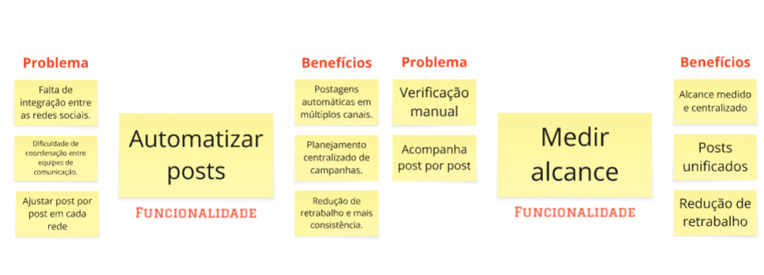
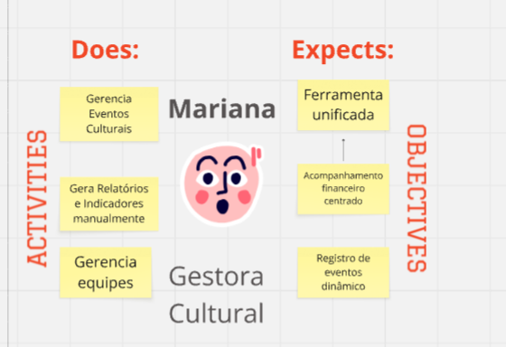
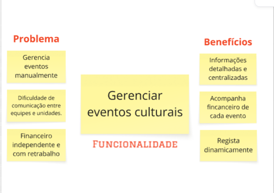
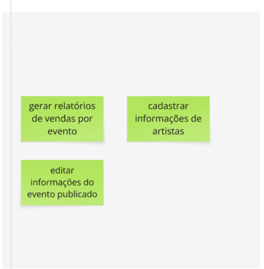
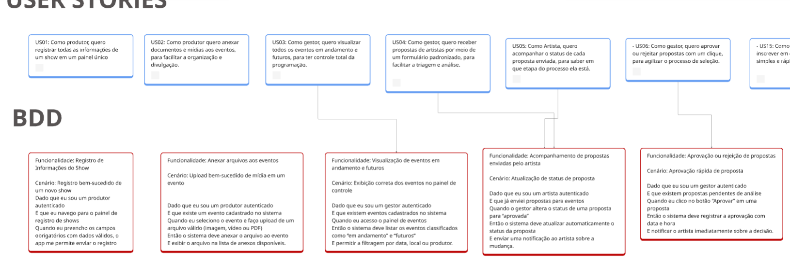

# PBB

### O quê é PBB?

Product Backlog Building (PBB) é a prática de detalhar e priorizar itens de backlog de produto de forma colaborativa, garantindo que o time de desenvolvimento entenda claramente as funcionalidades necessárias, seus critérios de aceitação e cenários de teste (BDD). O PBB auxilia na comunicação entre stakeholders, no planejamento de entregas e na definição de qualidade esperada para cada User Story.

### Como fazer?

A partir de uma dinâmica que consiste em vivenciar, na prática, a elaboração e criação de um backlog efetivo e colaborativo Envolve todas as pessoas que irão trabalhar no produto, esclarecendo as histórias de usuário e o backlog dos times, utilizando o **PBB Canvas** como ferramenta de facilitação.

## PBB Canvas

## Problemas e Expectativas

Consideramos como problemas e expectativas como:

- Problemas = o que está dificultando a vida da persona;

- Expectativas = o que ela gostaria que o produto resolvesse ou oferecesse;

### Personas e Funcionalidades

#### Persona 1 — Rafael — Produtor Independente

**Activities (Does):**

- Anota as informações de cada show

- Gera todas as propostas e processos de seleção

- Divulga produções e vende ingressos

**Objectives (Expects):**

- Não usar diferentes apps para gerir todas as informações necessárias

- Cadastro unificado de artistas e shows

- Um portal de venda de ingressos

#### Persona 2 — Lígia — Artista Visual

**Activities (Does):**

- Participa de oficinas e exposições

- Se inscreve em diferentes shows de diferentes instituições

- Acompanha campanhas de políticas culturais

**Objectives (Expects):**

Acompanhar o status das propostas realizadas

Local unificado para inscrição

Conferir frequência, diversidade e acessibilidade de cada show

#### Persona 3: Beatriz - Espectador

**Activities (Does):**

- Assiste diferentes eventos

- Acessa redes sociais em busca de novos eventos

- Gosta de consumir campanhas de divulgação de novos eventos
  
**Objectives (Expects):**

- Experiência integrada com calendário e área de compras
  
- Ver todos os eventos em um só lugar

- Ficar sabendo de novas campanhas

#### Persona 4 - Carlos - Gestor

**Activities (Does):**

- Consolidar relatórios

- Acompanha políticas públicas

- Avalia impacto de programas

**Objectives (Expects):**

- Relatórios confiáveis

- Todas informações em um só lugar

- Ferramenta que apoie decisoes

#### Persona 5 - Renata - Analisa

**Activities (Does):**

- Posta diariamente na mão

- Verifica engajamento de cada rede

**Objectives (Expects):**

- Ambiente centralizado

- Posts integrados e automatizados

- Alcance medido automaticamente

#### Persona 6 - Mariana - Gestora Cultural

**Activities (Does):**

- Gerencia Eventos Culturais

- Gera Relatórios e Indicadores manualmente

- Gerencia equipes

**Objectives (Expects):**

- Ferramenta unificada

- Acompanhamento financeiro centrado

- Registro de eventos dinâmico

## PBB Canvas - Miro
Segue o mesmo quadro PBB Canvas no miro para melhor visualização e interação:

<iframe width="768" height="432" src="https://miro.com/app/live-embed/uXjVJHChsK4=/?embedMode=view_only_without_ui&moveToViewport=-111337,42196,8665,4930&embedId=654400730863" frameborder="0" scrolling="no" allow="fullscreen; clipboard-read; clipboard-write" allowfullscreen></iframe>

## User Stories

Todas as histórias de usuário possuem critérios de aceitação acessíveis pelo **miro**. Abaixo, colocamos apenas os critérios da história US01, para exemplificar.

## Gestão de Informações de Eventos

- US01: Como gestor, quero registrar todas as informações de um show em um painel único, para evitar o uso de múltiplos aplicativos e manter tudo centralizado.

- - CRITÉRIOS DE ACEITAÇÃO:

- - - O sistema deve permitir que o produtor cadastre informações básicas do show, incluindo nome, data, horário, local e artistas participantes.
- - - O painel deve reunir todas as informações do show em uma única tela, sem a necessidade de navegar entre múltiplas páginas.
- - - Após salvar os dados, o produtor deve conseguir visualizar, editar e excluir as informações do show diretamente no painel.

- US02: Como gestor, quero anexar documentos e mídias aos eventos, para facilitar a organização e divulgação.
- US03: Como gestor, quero visualizar todos os eventos em andamento e futuros, para ter controle total da programação.

## Propostas e Processos de Seleção

- US04: Como gestor, quero receber propostas de artistas por meio de um formulário padronizado, para facilitar a triagem e análise.
- US05: Como Artista, quero acompanhar o status de cada proposta enviada, para saber em que etapa do processo ela está.
- US06: Como gestor, quero aprovar ou rejeitar propostas com um clique, para agilizar o processo de seleção.
- US15: Como Artista, quero me inscrever em editais de forma simples e rápida.

## Cadastro Unificado

- US07: Como gestor, quero cadastrar artistas e produções em um banco único, para evitar duplicidade e facilitar buscas futuras.
- US08: Como Artista, quero editar os meus dados e vincular minhas produções a eles, para manter meu histórico atualizado.

## Venda de Ingressos

- US09: Como gestor, quero publicar eventos com opção de venda de ingressos, para facilitar o acesso do público.
- US10: Como gestor, quero acompanhar em tempo real as vendas de ingressos, para ajustar estratégias de divulgação.
- US11: Como consumidor, quero comprar ingressos de forma rápida e segura pela plataforma.
- US16: Como consumidor, quero receber notificações sobre eventos de meu interesse.
- US17: Como gestor, quero configurar diferentes tipos de ingressos e preços para cada evento.

## Divulgação e Métricas

- US12: Como gestor, quero gerar campanhas de divulgação diretamente da plataforma, para otimizar o alcance dos eventos.
- US13: Como gestor, quero acessar relatórios de engajamento e vendas por evento, para avaliar o desempenho e tomar decisões estratégicas.
- US14: Como gestor, quero receber feedbacks dos artistas e do público, para melhorar continuamente a plataforma e os eventos organizados.

## BDD

Behavior Driven Development (BDD) é uma especificação executável para validar os critérios de aceite de uma história.

Fizemos BDD de grande parte das histórias, como é possível ver abaixo:

#### Descição de alguns dos BDD

**Funcionalidade: Registro de Informações do Show
Cenário: Registro bem-sucedido de um novo show**

- Dado que eu sou um produtor autenticado

- E que eu navego para o painel de registro de shows

- Quando eu preencho os campos obrigatórios com dados válidos, o app me permite enviar o registro

- Então o sistema deve registrar o novo show.

-----

**Funcionalidade: Anexar arquivos aos eventos
Cenário: Upload bem-sucedido de mídia em um evento**

- Dado que eu sou um produtor autenticado

- E que existe um evento cadastrado no sistema

- Quando eu seleciono o evento e faço upload de um arquivo válido (imagem, vídeo ou PDF)

- Então o sistema deve anexar o arquivo ao evento

- E exibir o arquivo na lista de anexos disponíveis.

-----

**Funcionalidade: Visualização de eventos em andamento e futuros
Cenário: Exibição correta dos eventos no painel de controle**

- Dado que eu sou um gestor autenticado

- E que existem eventos cadastrados no sistema

- Quando eu acesso o painel de eventos

- Então o sistema deve listar os eventos classificados como "em andamento" e "futuros"

- E permitir a filtragem por data, local ou produtor.

-----

**Funcionalidade: Acompanhamento de propostas enviadas pelo artista
Cenário: Atualização de status de proposta**

- Dado que eu sou um artista autenticado

- E que já enviei propostas para eventos

- Quando o gestor altera o status de uma proposta para "Aprovada"

- Então o sistema deve atualizar automaticamente o status da proposta

- E enviar uma notificação ao artista sobre a mudança.

-----

**Funcionalidade: Aprovação ou rejeição de propostas
Cenário: Aprovação rápida de proposta**

- Dado que eu sou um gestor autenticado

- E que existem propostas, pendentes de análise

- Quando eu clico no botão "Aprovar" em uma proposta

- Então o sistema deve registrar a aprovação com data e hora

- E notificar o artista imediatamente sobre a decisão.
