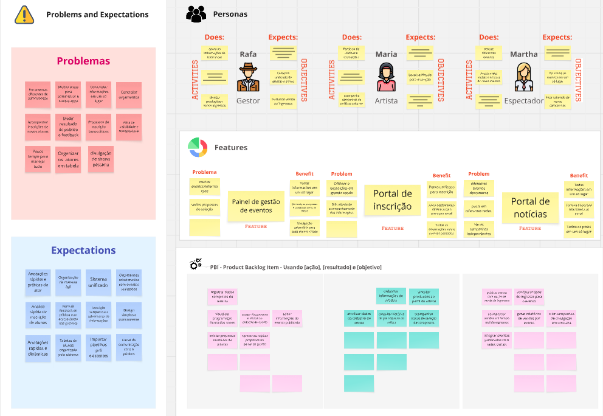
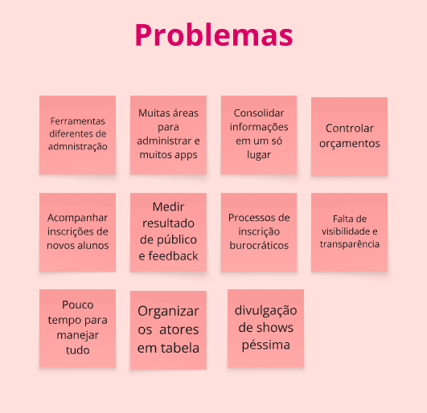
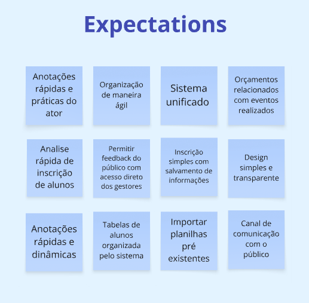
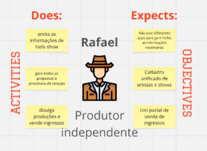
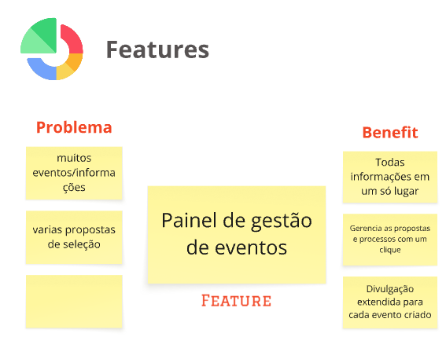
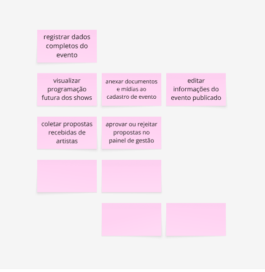
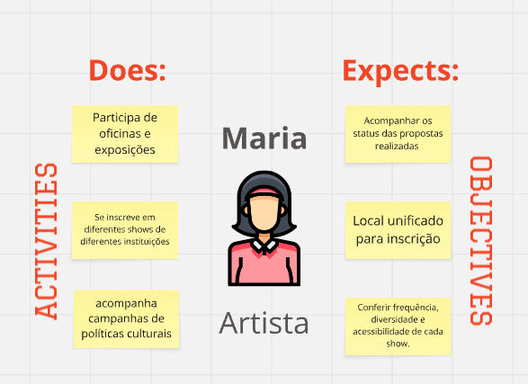
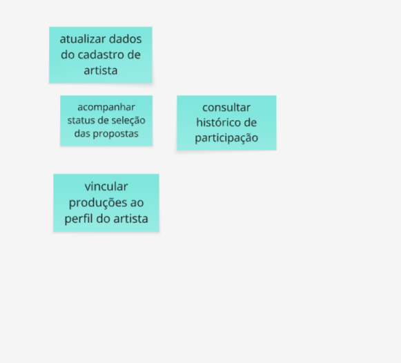
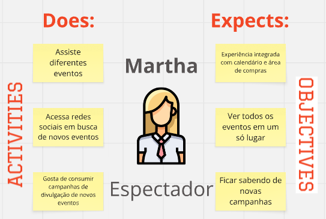
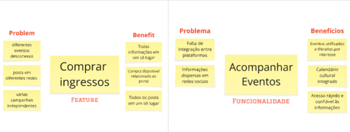

# PBB

### o quê é PBB?

Product Backlog Building (PBB) é a prática de detalhar e priorizar itens de backlog de produto de forma colaborativa, garantindo que o time de desenvolvimento entenda claramente as funcionalidades necessárias, seus critérios de aceitação e cenários de teste (BDD). O PBB auxilia na comunicação entre stakeholders, no planejamento de entregas e na definição de qualidade esperada para cada User Story.

### Como fazer?

A partir de uma dinâmica que consiste em vivenciar, na prática, a elaboração e criação de um backlog efetivo e colaborativo Envolve todas as pessoas que irão trabalhar no produto, esclarecendo as histórias de usuário e o backlog dos times, utilizando o **PBB Canvas** como ferramenta de facilitação.

## PBB Canvas

## Problemas e Expectativas

Consideramos como problemas e expectativas como:

- Problemas = o que está dificultando a vida da persona;

- Expectativas = o que ela gostaria que o produto resolvesse ou oferecesse;

### Personas e Funcionalidades

#### Persona 1: Rafa - Gestor

#### Persona 2: Martha - Artista

#### Persona 3: João - Espectador

## PBB Canvas - Miro
Segue o mesmo quadro PBB Canvas no miro para melhor visualização e interação:

<iframe
  width="100%"
  height="600"
  src="https://miro.com/app/board/uXjVJHChsK4=/?share_link_id=276528183035"
  frameborder="0"
  scrolling="no"
  allowfullscreen
></iframe>

## User Stories

## Gestão de Informações de Eventos

- US01: Como gestor, quero registrar todas as informações de um show em um painel único, para evitar o uso de múltiplos aplicativos e manter tudo centralizado.
- US02: Como gestor, quero anexar documentos e mídias aos eventos, para facilitar a organização e divulgação.
- US03: Como gestor, quero visualizar todos os eventos em andamento e futuros, para ter controle total da programação.

## Propostas e Processos de Seleção

- US04: Como gestor, quero receber propostas de artistas por meio de um formulário padronizado, para facilitar a triagem e análise.
- US05: Como Artista, quero acompanhar o status de cada proposta enviada, para saber em que etapa do processo ela está.
- US06: Como gestor, quero aprovar ou rejeitar propostas com um clique, para agilizar o processo de seleção.
- US15: Como Artista, quero me inscrever em editais de forma simples e rápida.

## Cadastro Unificado

- US07: Como gestor, quero cadastrar artistas e produções em um banco único, para evitar duplicidade e facilitar buscas futuras.
- US08: Como Artista, quero editar os meus dados e vincular minhas produções a eles, para manter meu histórico atualizado.

## Venda de Ingressos

- US09: Como gestor, quero publicar eventos com opção de venda de ingressos, para facilitar o acesso do público.
- US10: Como gestor, quero acompanhar em tempo real as vendas de ingressos, para ajustar estratégias de divulgação.
- US11: Como consumidor, quero comprar ingressos de forma rápida e segura pela plataforma.
- US16: Como consumidor, quero receber notificações sobre eventos de meu interesse.
- US17: Como gestor, quero configurar diferentes tipos de ingressos e preços para cada evento.

## Divulgação e Métricas

- US12: Como gestor, quero gerar campanhas de divulgação diretamente da plataforma, para otimizar o alcance dos eventos.
- US13: Como gestor, quero acessar relatórios de engajamento e vendas por evento, para avaliar o desempenho e tomar decisões estratégicas.
- US14: Como gestor, quero receber feedbacks dos artistas e do público, para melhorar continuamente a plataforma e os eventos organizados.
