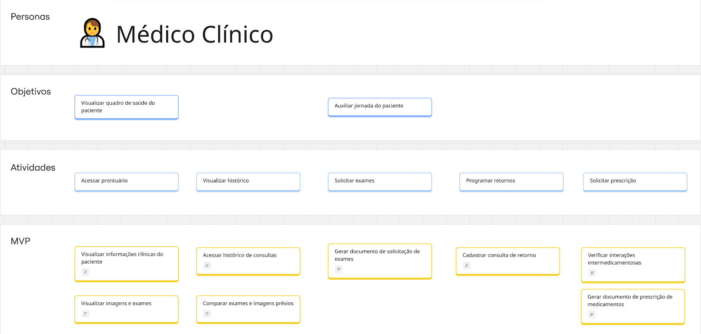
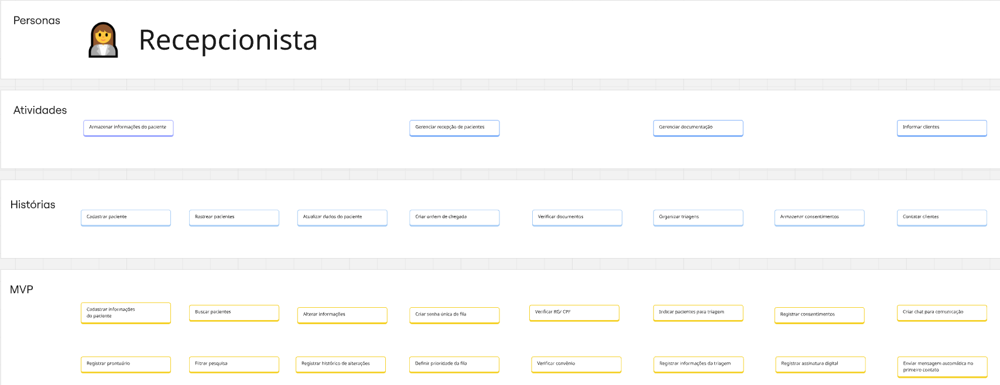
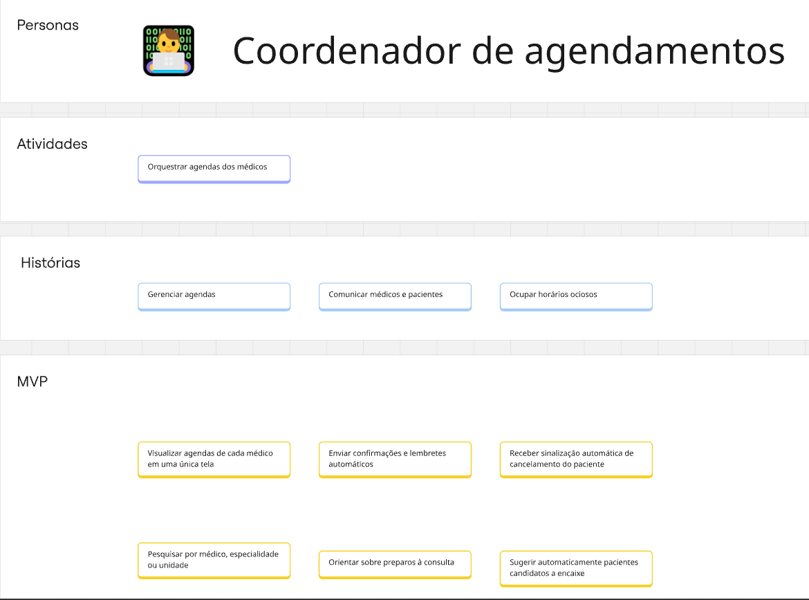
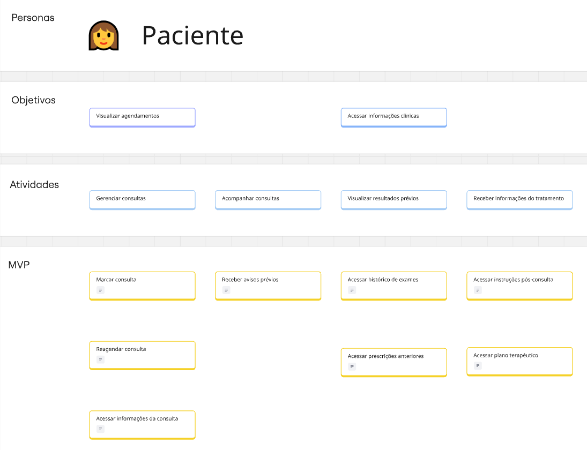
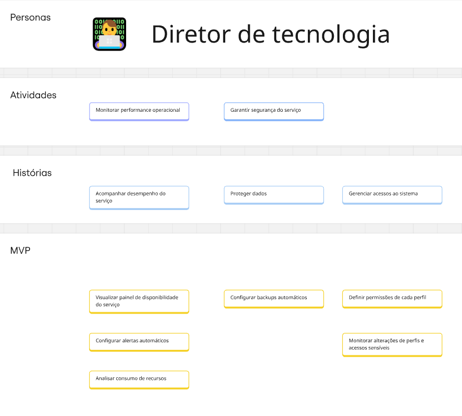
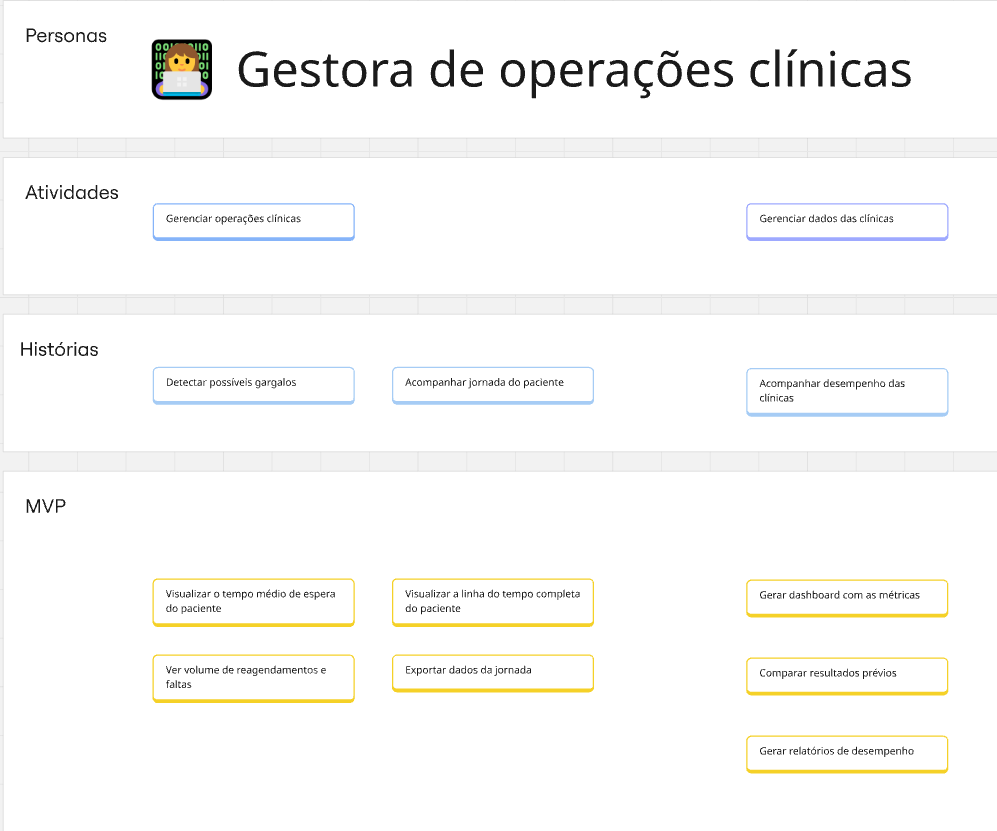

# Estudo de caso - USM: HealthConnect

### Sobre o User Story Mapping

Um User Story Mapping (USM) é uma abordagem utilizada para estruturar, visualizar e compreender as funcionalidades de um produto a partir da perspectiva do usuário. Essa técnica organiza o trabalho em torno da jornada que o usuário percorre para atingir seus objetivos, permitindo que a equipe compreenda o contexto e a lógica de uso antes de definir prioridades ou entregar funcionalidades.

No USM, parte-se da identificação do objetivo central do usuário e das principais atividades que ele realiza para alcançar esse objetivo. Em seguida, essas atividades são desdobradas em histórias de usuário, que representam funcionalidades específicas do produto. Essa estrutura facilita a visualização da experiência de ponta a ponta, tornando mais clara a relação entre necessidade do usuário e solução proposta.

### USM - HealthConnect

A “HealthConnect” é uma empresa que busca transformar a experiência digital de saúde em uma rede ampla de clínicas e hospitais. Dessa forma, ela busca uma plataforma que unifica múltiplas ferramentas, como: gestão do cuidado, prontuário eletrônico, agendamento, prescrições, comunicação multicanal e painéis gerenciais, com foco em segurança usabilidade e interoperabilidade.

## Personas, atividades e histórias

### Persona 1: Dr. João - Médico Clínico

### Persona 2: Maria - Recepcionista

### Persona 3: Lívia - Farmacêutica

### Persona 4: Rafael - Coordenador de Agendamento

### Persona 5: Clara - Paciente

### Persona 6: Roberto - Diretor de Tecnologia

### Persona 7: Ana - Gestora de Operações Clínicas

## USM Canvas - Miro
Segue o mesmo quadro USM Canvas no miro para melhor visualização e interação:

<iframe
  width="100%"
  height="600"
  src="https://miro.com/app/board/uXjVJDFL6uo=/?share_link_id=779745075154"
  frameborder="0"
  scrolling="no"
  allowfullscreen
></iframe>

