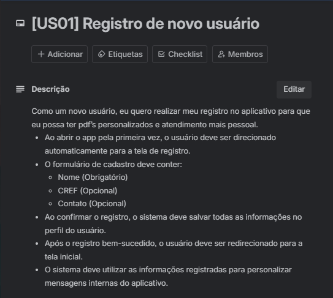
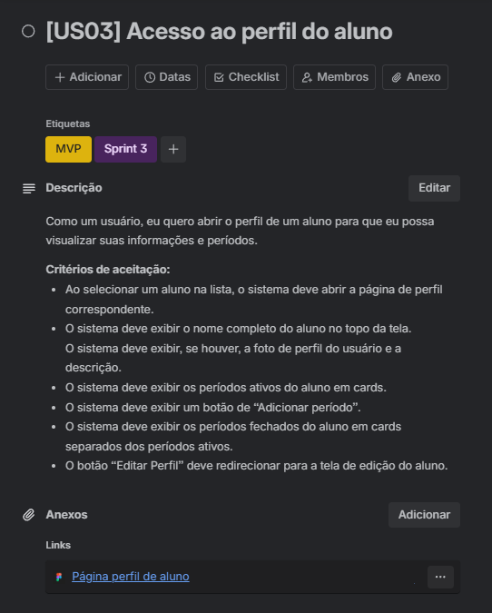
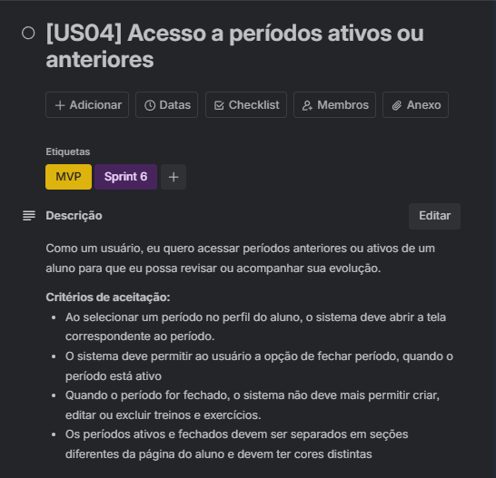
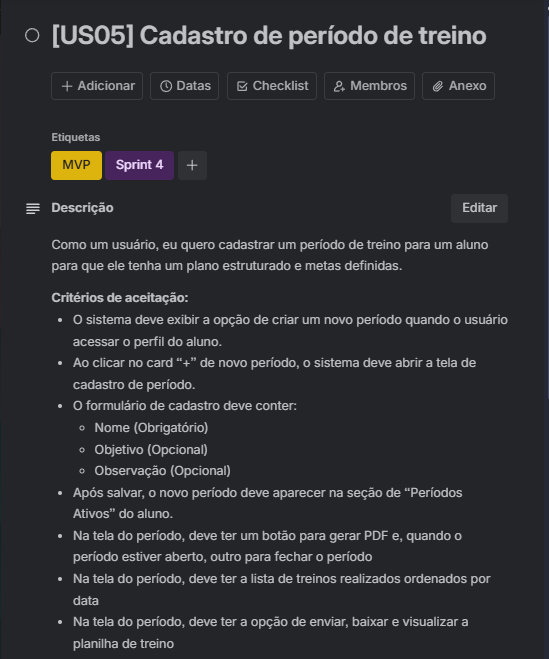
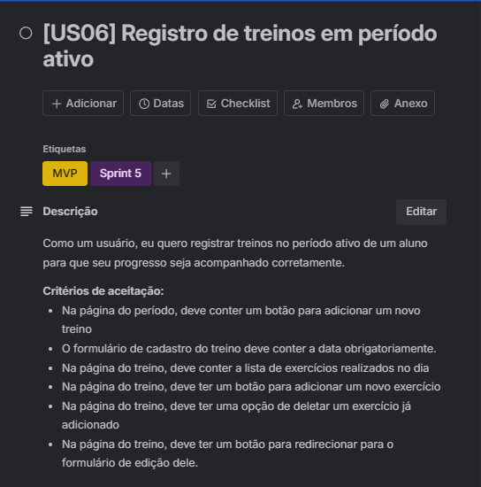
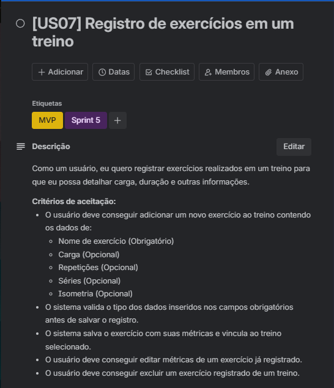
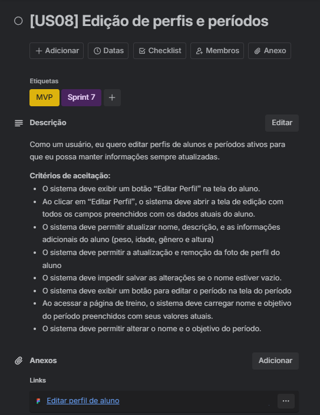
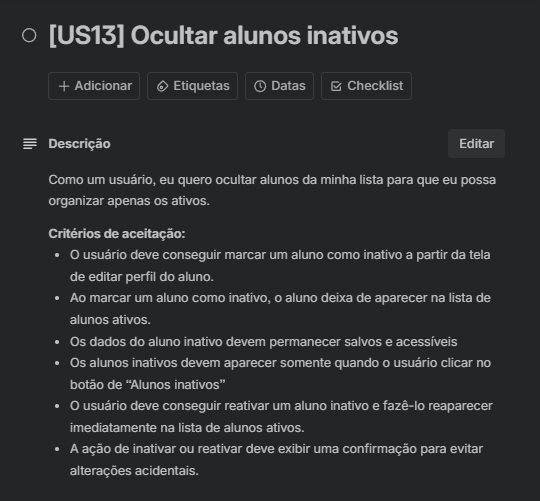

# Aplicação do DoR, DoD e Critérios de Aceitação no Projeto
## Ferramenta Utilizada
Utilizamos o Trello como ferramenta de apoio ao gerenciamento das histórias de usuário (US) do projeto. Cada cartão de US no Trello representa uma história e contém:

- Checklist de Definition of Ready (DoR)
- Checklist de Definition of Done (DoD)
- Critérios de aceitação
- Link direto para o protótipo correspondente, quando houver
- Etiquetas de sprint à qual ela pertence e se está incluida no mvp
  
## Organização do Quadro Trello
O quadro foi estruturado com as seguintes listas (colunas):

- Backlog – Contém todas as US identificadas
- Ready - História atende aos critérios de DoR
- Em andamento – US sendo implementadas
- Em Aceitação – US finalizadas aguardando validação do cliente
- Done - Atende todos os critérios de DoD

## Definition of Ready (DoR) e Definition of Done (DoD)

Para cada história de usuário (US) foi atribuído um checklist personalizado contendo todos os critérios definidos no nosso Definition of Ready (DoR) e Definition of Done (DoD).

Esse processo garantiu que nenhuma US fosse iniciada sem estar totalmente clara e validada, e que só fosse considerada concluída após cumprir todos os critérios de qualidade e validação final.

- Uma US só era movida para a coluna "Em andamento" quando todos os itens do checklist de DoR estavam completos.

- Após ser implementada, a US era movida para "Em Aceitação", onde permanecia aguardando o feedback do cliente. Somente após a validação completa e a checagem de todos os itens do checklist de DoD, ela era movida para a coluna "Done".

## Evidências Visuais

Abaixo estão capturas de tela de algumas das histórias de usuário no Trello, evidenciando:

- O uso dos checklists de Definition of Ready (DoR) e Definition of Done (DoD)
- A definição clara dos critérios de aceitação.
- A vinculação com o protótipo correspondente, se tiver

## US01 – Registro de novo usuário

## US02 – Cadastro de aluno

## US03 – Acesso ao perfil do aluno

## US04 – Acesso a períodos ativos ou anteriores

## US05 – Cadastro de período de treino

## US06 – Registro de treinos em período ativo

## US07 – Registro de exercícios em um treino

## US08 – Edição de perfis e períodos

## US09 – Fechamento de período de treino

## US10 – Geração de PDF ao encerrar período

## US11 – PDF completo de relatório

## US12 - Busca de alunos por nome

## US13 - Ocultar alunos inativos

## US14 – Exclusão de aluno

## US15 - Adição de observações

