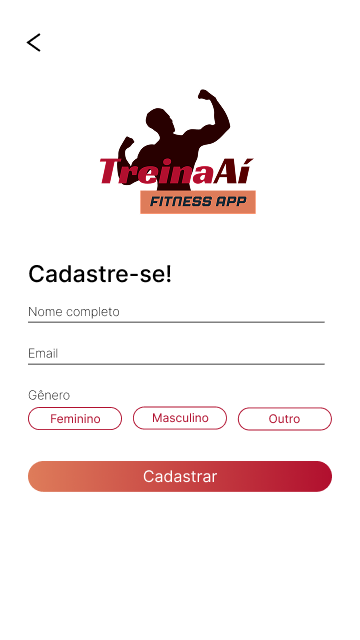
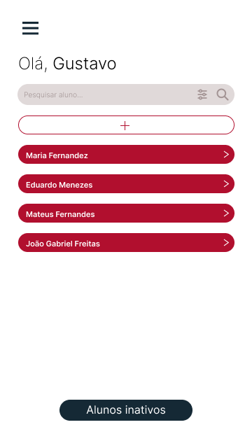
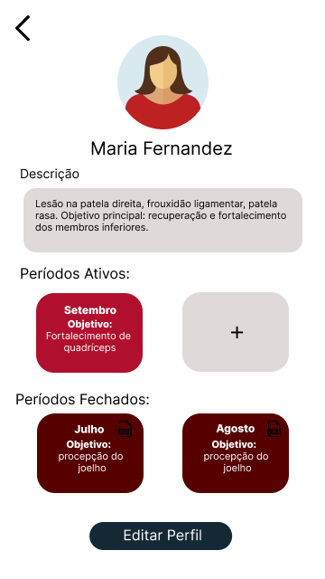
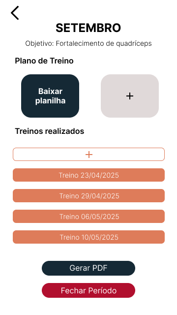

# Protótipos
Estes são os protótipos de alta fidelidade, desenvolvidos no Figma, e utilizados para validar fluxos de navegação, interações e layout.

## Protótipo do Cadastro

## Protótipo da página de alunos

## Protótipo do perfil do aluno

## Protótipo de editar perfil do aluno

## Protótipo do período

