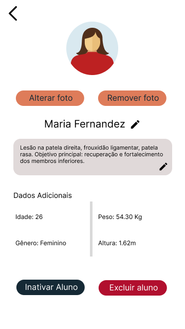

# Protótipos
Estes são os protótipos de alta fidelidade, desenvolvidos no Figma, e utilizados para validar fluxos de navegação, interações e layout.

## Figma:
Abaixo você pode visualizar e navegar pelo design:

<iframe
  style="border: none;"
  width="100%"
  height="600"
  src="https://www.figma.com/embed?embed_host=share&url=https://www.figma.com/design/RmMGBMZuKP72cDZgRkhCPF/P%C3%A1ginas?node-id=0-1&t=LAyPre5F5Eu68Qz6-1"
  allowfullscreen>
</iframe>

## Protótipo do Cadastro

## Protótipo da página de alunos

## Protótipo do perfil do aluno

## Protótipo de editar perfil do aluno

## Protótipo do período

